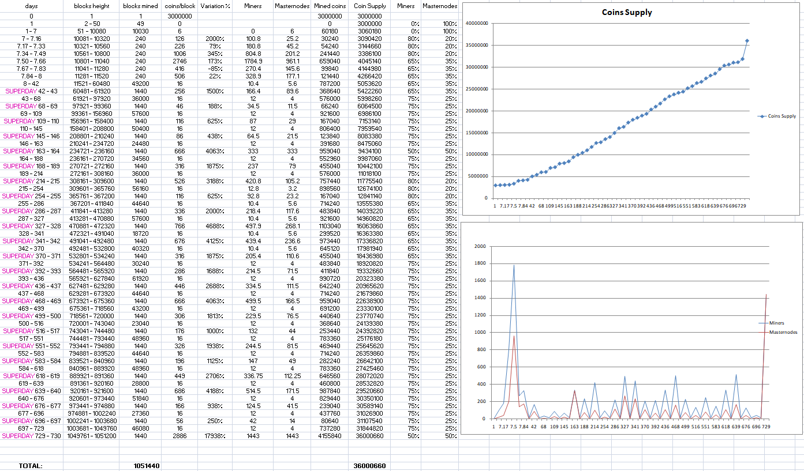

Minerium staging treeMinerium staging treeMinerium staging tree 
=========================

`master:`  

https://MineriumCoin.com

What is Minerium?
----------------

Minerium is a merge-minable SHA256 coin which provides an array of useful services
which leverage the bitcoin protocol and blockchain technology.

- 1 minute block targets, diff retarget every 3 blocks using Dark Gravity Wave(24) 
- Rewards are variable:
  - 25/100 percent cycle to masternodes  see: https://mineriumcoin.com/block_rewards.png (or image below)
  - remainder to miner
  - miner and masternode share fees 50:50
- SHA256 Proof of Work
- Mineable either exclusively or via merge-mining any SHA256 PoW coin
- Minerium data service fees burned
- Masternode collateral requirement: 15000 Mineriums

-The superblocks have been removed, and instead we implemented a new function called "SuperDay" during which the blocks reward receive an important augmentation of it's amount.
    The goal beeing to give a chance of the new miners joining the project late in time since it started, to mine it themselves,        and not being forced to buy at the exchange.
    Making a mining process less boring, less linear and more interesting.

For more information, as well as an immediately useable, binary version of
the Minerium client sofware, see https://mineriumcoin.com/  (downloads section)

License
-------

MineriumCoin is released under the terms of the MIT license. See [COPYING](COPYING) for more
information or see https://opensource.org/licenses/MIT.

Development Process
-------------------

The `master` branch is meant to be stable. Development is normally done in separate branches.
[Tags](https://github.com/minerium/minerium/tags) are created to indicate new official,
stable release versions of Minerium Core.

The contribution workflow is described in [CONTRIBUTING.md](CONTRIBUTING.md).

Testing
-------

Testing and code review is the bottleneck for development; we get more pull
requests than we can review and test on short notice. Please be patient and help out by testing
other people's pull requests, and remember this is a security-critical project where any mistake might cost people
lots of money.

### Automated Testing

Developers are strongly encouraged to write [unit tests](/doc/unit-tests.md) for new code, and to
submit new unit tests for old code.

There are also [regression and integration tests](/qa) of the RPC interface, written
in Python, that are run automatically on the build server.
These tests can be run (if the [test dependencies](/qa) are installed) with: `qa/pull-tester/rpc-tests.py`

Minerium test suites can run by `cd src/test && ./test_minerium`

The Travis CI system makes sure that every pull request is built for Windows
and Linux, OS X, and that unit and sanity tests are automatically run.

### Manual Quality Assurance (QA) Testing

Changes should be tested by somebody other than the developer who wrote the
code. This is especially important for large or high-risk changes. It is useful
to add a test plan to the pull request description if testing the changes is
not straightforward.

Translations
------------

Changes to translations as well as new translations can be submitted to
[Minerium Core's Transifex page](https://www.transifex.com/projects/p/minerium/).

Translations are periodically pulled from Transifex and merged into the git repository. See the
[translation process](doc/translation_process.md) for details on how this works.

**Important**: We do not accept translation changes as GitHub pull requests because the next
pull from Transifex would automatically overwrite them again.

